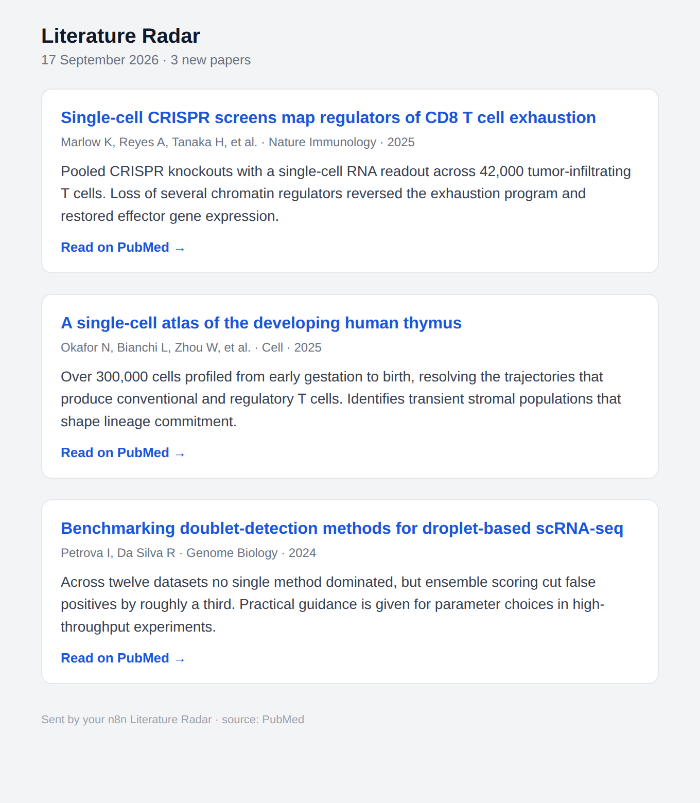
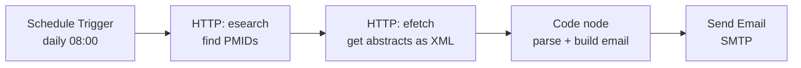
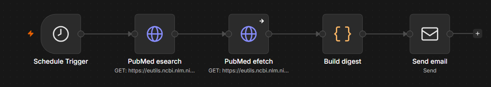

# Literature Radar

A small [n8n](https://n8n.io) workflow that emails me a daily digest of new PubMed
papers matching a search I care about. It runs on a schedule, pulls fresh results
from NCBI, formats them into a readable email, and sends it. No dashboards to check,
the papers just show up in my inbox.

I built it to stay on top of single-cell and CRISPR literature without opening PubMed
every morning, which are topics that have always interested me but haven't had the chance to work closely with.  
Additionally it functions as a clean end-to-end n8n project to point people at.



**The email body sent by the workflow.**  
*Papers shown here are sample data.*

## What it does

- Runs every day at 08:00 (configurable, or switch it to weekly).
- Searches PubMed for a query you set, limited to papers from the last N days.
- Fetches the abstract, journal, year and authors for each hit.
- Builds one HTML email: title, first three authors, a two-sentence summary, and a link.
- Sends it over SMTP. On a day with no matches you still get a short "nothing new" note
  instead of a broken run.

## How it works



Five nodes, wired left to right:

1. **Schedule Trigger** fires once a day.
2. **esearch** calls the NCBI E-utilities `esearch` endpoint and gets back a JSON list
   of PubMed IDs for the query and date window.
3. **efetch** takes those IDs and pulls the full records back as XML.
4. **Code node** parses the XML with a few regexes, trims each abstract down to a short
   summary, and returns `{ subject, html, count }`.
5. **Send Email** sends `subject` and `html` to my address.

The parser lives in [`literature-radar-code-node.js`](literature-radar-code-node.js)
so it is easy to read without importing anything. The whole workflow is in
[`workflow.json`](workflow.json).



## Run it yourself

You need [Docker](https://docs.docker.com/get-docker/). n8n runs locally, nothing is
paid or hosted.

```bash
git clone <your-fork-url> literature-radar
cd literature-radar
docker compose up -d
```

Open http://localhost:5678 and finish setup:

1. In n8n, use the workflow menu and **Import from File**, then pick `workflow.json`.
2. Open the **Send Email** node, create an SMTP credential, and set the From/To
   addresses. For Gmail, generate an app password (Google Account, Security, App
   passwords) and use host `smtp.gmail.com`, port 465, SSL on.
3. Edit the **esearch** node's `term` parameter to your own search.
4. Hit **Execute Workflow** once to test. Check your inbox.
5. Flip the workflow to **Active** and it runs on schedule.

Before the first run, set your timezone in `docker-compose.yml` (`GENERIC_TIMEZONE`
and `TZ`) so 08:00 means 08:00 where you are.

```bash
docker compose logs -f n8n   # watch it
docker compose down          # stop it, workflow and credentials are kept
```

## Customizing

- **Search:** change `term` in the esearch node, for example
  `crispr AND (single cell OR scRNA-seq)`.
- **Frequency:** change the Schedule Trigger, and remember to move `reldate` to match.
- **Newer additions:** swap `datetype=pdat` for `edat` to catch papers newly added to
  PubMed rather than by publication date.
- **Higher volume:** add a free NCBI `api_key` query param if you raise the frequency,
  to stay under the rate limit.

## A note on "always running"

This is self-hosted on purpose. n8n Cloud is paid after its trial, and running it
locally with Docker is free.  
Therefore, a workflow only fires while the
host machine is awake, and n8n does not back-fill runs it missed while off. On a laptop
that means "runs whenever the machine is on at 08:00."  
For a true 24/7 you would put
the same Docker setup on an always-on box, such as a small VM or a Raspberry Pi.

## Repo layout

```
docker-compose.yml               n8n, pinned to a named volume so data survives restarts
workflow.json                    the importable n8n workflow (5 nodes)
literature-radar-code-node.js    the parser and email builder, standalone and readable
docs/img/                        screenshots used in this README
```

## License

MIT. See [LICENSE](LICENSE).
